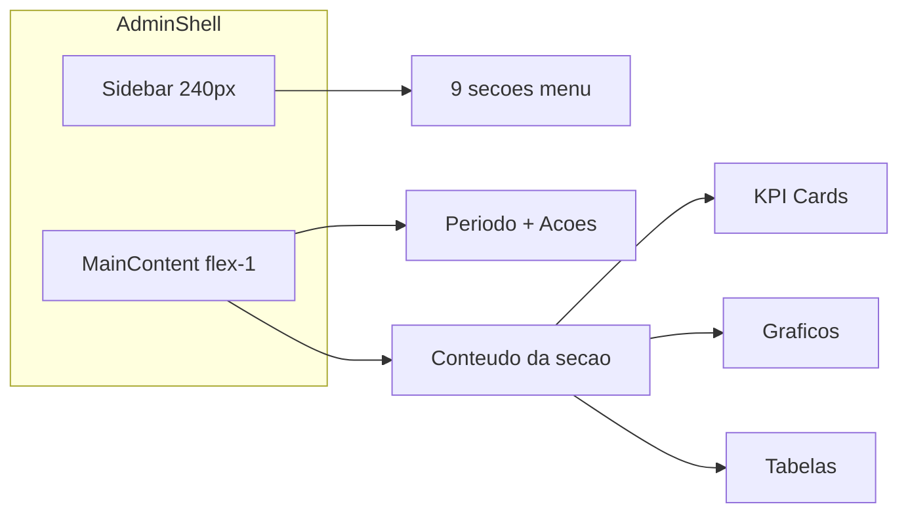

# Dashboard Admin Moderno — Especificação UX/UI

> **Documento de referência** para evolução do painel interno `/paineladmin-monitoring-v0`.  
> Não é implementação — é blueprint de produto + design system aplicado ao monitoring.  
> **Baseline de código:** `admin-panel/`, `app/paineladmin-monitoring-v0/`, `app/api/admin/*`

---

## 1. Visão e princípios

### Objetivo

Transformar o painel MVP (single-page com barras CSS) em um **dashboard analítico moderno**, segmentado por menu lateral, com gráficos interativos e filtros de período ampliados — mantendo a identidade visual do app Nosso Momento.

### Princípios de design

1. **Dark-first** — fundo `#0a0a0a`, cards glass com blur sutil, alto contraste para leitura de dados.
2. **Segmentação clara** — cada dimensão analítica (geo, gênero, pareamento…) tem sua própria view no menu lateral.
3. **Dados agregados only** — nunca expor PII em gráficos; emails mascarados em tabelas; acesso restrito à allowlist `ADMIN_MONITORING_EMAILS`.
4. **Período explícito** — distinguir métricas temporais (filtradas pelo período) de snapshots acumulados (base total).
5. **Selects legíveis** — **sempre** fundo cinza escuro + texto branco (regra não negociável).
6. **Progressive enhancement** — Fase 1 usa dados já disponíveis em `aggregateMetrics.ts`; Fase 2 estende a API.

### Referências visuais incorporadas

| Referência | Elementos adotados |
|------------|-------------------|
| **Exemplo 1** (agency dashboard) | Sidebar esquerda com item ativo em gradiente; KPI cards coloridos com delta %; donut + line chart; toolbar de modos de visualização |
| **Exemplo 2** (glassmorphism dashboard) | Cards modulares com glass effect; anéis de progresso + sparklines; mapa geolocalizado com callouts; tabelas de dados; dropdowns escuros no topo |

---

## 2. Identidade visual

Tokens extraídos de `app/globals.css` e componentes atuais do painel.

### Paleta

| Token | Valor | Uso no painel |
|-------|-------|---------------|
| Fundo app | `#0a0a0a` | Canvas principal |
| Fundo seções | `#141414` | Área de conteúdo alternativa |
| Fundo cards glass | `rgba(30, 30, 30, 0.7)` + `backdrop-filter: blur(10px)` | Cards de gráficos e tabelas |
| Fundo KPI cards | `linear-gradient(145deg, #1a1225 0%, #0f0b14 100%)` | Stat cards |
| Texto primário | `#ededed` / `#ffffff` | Labels, valores, títulos |
| Texto secundário | `rgba(255,255,255,0.4)` – `0.7` | Hints, eixos, timestamps |
| Accent primário | `#ff2d3f` → `#ff5565` | Barras, item ativo sidebar, CTAs, gradiente de destaque |
| Accent hover primário | `#ff4252` → `#ff7b8a` | Hover em botões |
| Sombra accent | `rgba(255, 53, 71, 0.3)` | Glow sutil em cards ativos |
| Série 1 — roxo | `#a78bfa` | Pareamentos |
| Série 2 — verde | `#34d399` | Cadastros / crescimento |
| Série 3 — azul | `#38bdf8` | Ativos / engajamento |
| Série 4 — rosa | `#f472b6` | Pareados |
| Série 5 — âmbar | `#fbbf24` | Push / notificações |
| Bordas | `rgba(255,255,255,0.10)` – `0.15` | Cards, inputs, separadores |
| Grid de gráficos | `rgba(255,255,255,0.05)` | Linhas de referência |

### Tipografia

- **Família:** `Arial, Helvetica, sans-serif` (consistente com `body` do app)
- **Títulos de seção:** 18–20px, `font-semibold`, branco
- **KPI valor:** 24–32px, `font-bold`, `tabular-nums`
- **Labels KPI:** 11–12px, uppercase, `tracking-wide`, `white/50`
- **Eixos de gráfico:** 11px, `white/50`

### Marca no painel

```
Nosso Momento
Monitoring — uso interno
```

Posição: topo da sidebar, acima dos itens de navegação. Ícone opcional: coração/gradiente coral (`icon-gradient`).

---

## 3. Regra obrigatória — caixas de seleção

**Todas** as caixas de seleção (`<select>`, combobox, dropdown de período) devem seguir:

```css
/* Select / dropdown — SEMPRE */
background-color: #2a2a2a;   /* cinza escuro */
color: #ffffff;               /* texto branco */
border: 1px solid rgba(255, 255, 255, 0.15);
border-radius: 8px;
padding: 8px 12px;
font-size: 14px;

select option {
  background-color: #2a2a2a;
  color: #ffffff;
}

select:focus {
  border-color: #ff5565;
  box-shadow: 0 0 0 2px rgba(255, 85, 101, 0.2);
  outline: none;
}
```

Tailwind equivalente para implementação:

```
className="rounded-lg bg-[#2a2a2a] text-white border border-white/15 px-3 py-2 text-sm"
```

**Nunca** usar fundo claro, texto escuro ou `bg-white/5` em selects do painel admin.

---

## 4. Arquitetura de layout

### Estrutura geral



### Dimensões

| Elemento | Desktop | Mobile |
|----------|---------|--------|
| Sidebar | 240px fixa | Drawer overlay (hamburger) |
| Main padding | 24–32px | 16px |
| Gap entre cards | 16–24px | 12px |
| KPI grid | 6 colunas → 3 → 2 | 2 colunas |
| Border-radius cards | 12–16px | 12px |

### Top bar (sempre visível no main)

Conteúdo da esquerda para direita:

1. **Título da seção ativa** (ex.: "Visão Geral")
2. **Timestamp** — `Gerado em {generatedAt}` em `text-xs text-white/35`
3. **Seletor de período** — select ou pill group (regra de cor escura)
4. **Botão Atualizar** — recarrega métricas
5. **Botão Exportar CSV** — link para `/api/admin/export`
6. **Botão Sair** — `DELETE /api/admin/session`

### Navegação entre seções

Opções de implementação (escolher uma na Fase B):

- **Query param:** `/paineladmin-monitoring-v0?view=geolocalizada`
- **Sub-rotas:** `/paineladmin-monitoring-v0/geolocalizada`

Métricas carregadas **uma vez** por mudança de período; troca de seção apenas altera a view (sem refetch desnecessário).

### Wireframe textual

```
┌─────────────┬──────────────────────────────────────────────────┐
│ [Logo]      │  Visão Geral          [Período ▼] [↻] [CSV] [Sair]│
│ Nosso       │  Gerado em 14/06/2026 15:30                        │
│ Momento     │                                                    │
│             │  ┌────┐ ┌────┐ ┌────┐ ┌────┐ ┌────┐ ┌────┐          │
│ ● Visão Geral│  │ KPI│ │ KPI│ │ KPI│ │ KPI│ │ KPI│ │ KPI│          │
│   Geolocal. │  └────┘ └────┘ └────┘ └────┘ └────┘ └────┘          │
│   Gênero    │  ┌─────────────────────┐ ┌──────────────────┐     │
│   Paream.   │  │  Line/Area cadastros │ │ Donut / Sparkline │     │
│   Demogr.   │  └─────────────────────┘ └──────────────────┘     │
│   Engajam.  │  ┌─────────────────────────────────────────────┐   │
│   Loja      │  │  Tabela ou mapa (conforme seção)             │   │
│   Cadastros │  └─────────────────────────────────────────────┘   │
│   Export    │                                                    │
└─────────────┴──────────────────────────────────────────────────┘
```

### Sidebar — item ativo

Estado normal: `text-white/60`, ícone + label.  
Estado ativo: fundo `linear-gradient(135deg, #ff3547 0%, #ff6b7c 100%)`, texto branco, border-radius 8px, padding 10px 12px.

Estado hover (inativo): `bg-white/5`, `text-white/80`.

---

## 5. Filtros de período

### Opções

| Label UI | Valor API (`days`) | Uso típico |
|----------|-------------------|------------|
| 7 dias | `7` | Pulse diário, beta fechado |
| 15 dias | `15` | Tendência curta |
| 30 dias | `30` | **Default** — visão mensal |
| 90 dias | `90` | Trimestre |
| 6 meses | `180` | Semestre |
| 12 meses | `365` | Anual, sazonalidade |

Endpoint: `GET /api/admin/metrics?days={N}`

### Comportamento por tipo de métrica

| Tipo | Comportamento | Exemplo |
|------|---------------|---------|
| **Temporal** | Filtra pelo período selecionado | Cadastros no período, `signupsByDay` |
| **Snapshot acumulado** | Base total de usuários (independente do período) | Distribuição por UF, gênero, anatomia |
| **Híbrido** | Valor total + subset no período | Total usuários + cadastros no período |

**UI:** exibir nota contextual quando a seção usa snapshot:

> _Distribuição demográfica — base total de {N} usuários cadastrados._

### Componente `PeriodFilter`

- Variante A: `<select>` único (recomendado para mobile)
- Variante B: pill group horizontal (desktop)

Ambas com fundo `#2a2a2a` e texto branco.

---

## 6. Menu lateral — seções detalhadas

Ícones sugeridos (Lucide ou similar): `LayoutDashboard`, `MapPin`, `Users`, `Heart`, `BarChart3`, `Activity`, `ShoppingBag`, `UserPlus`, `Download`.

---

### 6.1 Visão Geral

**Objetivo:** panorama executivo do produto em uma tela.

| Elemento | Tipo | Dados | Fase |
|----------|------|-------|------|
| Total usuários | KPI card | `totals.users` | 1 |
| Cadastros no período | KPI card | `totals.signupsInPeriod` | 1 |
| Taxa de crescimento % | KPI card + delta | vs período anterior | 2 |
| Pareamentos (collection) | KPI card | `totals.pareamentos` | 1 |
| Usuários pareados | KPI card | `totals.withPairing` | 1 |
| Push ativo | KPI card | `totals.notificationsEnabled` | 1 |
| Cadastros por dia | Line/Area chart | `signupsByDay` | 1 |
| Cadastros por semana | Bar chart | rollup de `signupsByDay` | 1 |
| % pareados | Anel de progresso | `withPairing / users` | 1 |
| % push ativo | Anel de progresso | `notificationsEnabled / users` | 1 |
| % ativos 7d | Anel de progresso | `activeInPeriod / users` | 1 |

**Layout sugerido:** 6 KPI cards → linha com area chart (2/3) + 3 anéis (1/3) → bar semanal abaixo.

---

### 6.2 Visão Geolocalizada

**Objetivo:** entender distribuição geográfica da base.

| Elemento | Tipo | Dados | Fase |
|----------|------|-------|------|
| Mapa do Brasil | Geo map + callouts | `byEstado` | 1 (UF) |
| Distribuição por UF | Donut + legenda % | `byEstado` | 1 |
| Top 10 cidades | Bar horizontal | `byCidade` (nova agregação) | 2 |
| Tabela UF × count | Data table sortável | `byEstado` | 1 |
| Tabela cidade × UF × count | Data table | `byCidade` | 2 |

**Mapa:** SVG do Brasil ou biblioteca leve; intensidade de cor na escala `#0f0b14` → `#ff5565` proporcional ao count. Callouts nos top 5 UFs (estilo exemplo 2: "142 usuários | SP").

**Privacidade:** agregar por UF/cidade apenas; nunca plotar endereço individual.

---

### 6.3 Visão de Gênero

**Objetivo:** composição de gênero da base e correlações.

| Elemento | Tipo | Dados | Fase |
|----------|------|-------|------|
| Distribuição por gênero | Donut | `byGenero` | 1 |
| Ranking gênero | Bar horizontal | `byGenero` | 1 |
| Gênero × pareamento | Stacked bar | cross-tab | 2 |
| "Não informado" | KPI badge | count em `byGenero` | 1 |

Nota de produto: incluir valores de `generoOutro` agregados como categoria separada se existirem.

---

### 6.4 Visão de Pareamento

**Objetivo:** saúde do core loop do app (casal conectado).

| Elemento | Tipo | Dados | Fase |
|----------|------|-------|------|
| Total pareamentos | KPI | `totals.pareamentos` | 1 |
| Usuários pareados | KPI | `totals.withPairing` | 1 |
| Usuários solteiros | KPI | `users - withPairing` | 1 |
| Taxa conversão | KPI % | `withPairing / users` | 1 |
| Funnel | Funnel chart | cadastrados → pareados → ativos 7d | 1 |
| Novos pareamentos/dia | Line chart | `pareamentosByDay` | 2 |
| Pareamento por UF | Bar chart | cross-tab | 2 |

**Funnel visual:**

```
[Cadastrados: N] ──→ [Pareados: M] ──→ [Ativos 7d: K]
        100%              M/N %              K/M %
```

---

### 6.5 Visão Demográfica

**Objetivo:** perfil demográfico agregado para decisões de produto e conteúdo.

| Elemento | Tipo | Dados | Fase |
|----------|------|-------|------|
| Estado civil | Donut | `byEstadoCivil` | 1 |
| Orientação sexual | Bar horizontal | `byOrientacao` | 1 |
| Faixa etária | Histograma | `dataNascimento` → buckets | 2 |
| Tempo de relacionamento | Bar | campos de cadastro namorando/casado | 2 |

Buckets sugeridos para faixa etária: 18–24, 25–34, 35–44, 45–54, 55+.

---

### 6.6 Visão de Engajamento

**Objetivo:** retenção e uso ativo do app.

| Elemento | Tipo | Dados | Fase |
|----------|------|-------|------|
| Ativos (7d) | KPI | `totals.activeInPeriod` | 1 |
| Ativos trend | Line chart | `activeByDay` | 2 |
| Push ativo / inativo | Donut | `notificationsEnabled` | 1 |
| Check-in clima por dia da semana | Heatmap | collection clima | 2 |
| Sparkline retenção | Mini area | derivado de `lastCheckInDate` | 2 |

**Nota atual:** `activeInPeriod` usa janela fixa de 7 dias independente do filtro de período. Documentar na UI até Fase 2 corrigir.

---

### 6.7 Visão Loja / Personalização

**Objetivo:** entender escolhas de catálogo e personalização da loja.

| Elemento | Tipo | Dados | Fase |
|----------|------|-------|------|
| Anatomia (catálogo) | Donut | `byAnatomia` | 1 |
| Anatomia ranking | Bar horizontal | `byAnatomia` | 1 |
| Gênero × anatomia | Stacked bar | cross-tab | 2 |
| Insight card | Text card | % que escolheu catálogo manualmente | 2 |

---

### 6.8 Visão de Cadastros

**Objetivo:** analisar aquisição e ritmo de novos usuários.

| Elemento | Tipo | Dados | Fase |
|----------|------|-------|------|
| Cadastros por dia | Bar chart interativo | `signupsByDay` | 1 |
| Cadastros por mês | Bar chart | rollup mensal (período ≥ 90d) | 1 |
| Média diária no período | KPI | `signupsInPeriod / periodDays` | 1 |
| Últimos cadastros | Tabela sortável | email mascarado, UF, data | 2 |

Mascaramento de email: `a***@dominio.com`

---

### 6.9 Exportação & Dados

**Objetivo:** exportação segura para análise externa.

| Elemento | Descrição |
|----------|-----------|
| Exportar CSV | Botão → `GET /api/admin/export` (implementado) |
| Metadados exibidos | Período selecionado, `generatedAt`, versão do painel |
| Colunas CSV | uid, email, nome, estado, cidade, genero, anatomia, estadoCivil, createdAt, lastCheckIn, pareado, notificationsEnabled |
| LGPD | Uso interno; acesso restrito; não compartilhar CSV externamente |

---

## 7. Catálogo de componentes UI

| Componente | Responsabilidade | Props principais |
|------------|------------------|------------------|
| `AdminShell` | Layout sidebar + main + drawer mobile | `children`, `activeSection` |
| `AdminSidebarNav` | Lista de 9 seções com ícones | `items`, `activeId`, `onSelect` |
| `AdminTopBar` | Título, período, ações | `section`, `days`, `generatedAt`, handlers |
| `PeriodFilter` | Select/pills de período | `value`, `onChange`, `options` |
| `KpiCard` | Valor + label + delta opcional | `label`, `value`, `delta`, `accent`, `hint` |
| `ProgressRing` | Anel circular % | `value`, `max`, `color`, `label` |
| `DonutChart` | Gráfico rosca + legenda | `data`, `colors`, `centerLabel` |
| `LineAreaChart` | Tendência temporal | `data`, `xKey`, `yKey`, `color` |
| `BarChartSimple` | Barras horizontais (evoluir) | `title`, `items` — já existe |
| `GeoMapBr` | Mapa BR com tooltips | `byEstado`, `colorScale` |
| `DataTable` | Tabela sortável paginada | `columns`, `rows`, `sortable` |
| `EmptyState` | Sem dados | `message` — padrão: "Sem dados ainda." |
| `LoadingSkeleton` | Placeholder durante fetch | variantes: card, chart, table |

### Estados globais

| Estado | Tratamento |
|--------|------------|
| Loading | Skeleton nos cards; spinner discreto no top bar |
| Erro | Banner `text-red-400`: "Falha ao carregar métricas." + botão retry |
| Empty | `EmptyState` dentro do card afetado |
| 401 | Redirect para `/paineladmin-monitoring-v0/login` |

---

## 8. Biblioteca de gráficos (recomendação técnica)

| Necessidade | Biblioteca | Notas |
|-------------|------------|-------|
| Line, Area, Bar, Donut | **Recharts** | Leve, React-native, customizável com cores da marca |
| Alternativa | Chart.js + react-chartjs-2 | Mais pesado, boa para donut animado |
| Mapa BR | SVG customizado ou `@react-map/brazil` | Evitar Mapbox (overkill + API key) |
| Sparklines | Recharts `AreaChart` height 40px | Dentro de `KpiCard` |
| Anéis de progresso | SVG/CSS puro | Concentric rings, sem dependência |
| Funnel | CSS flex ou Recharts custom | 3 estágios horizontais |

### Paleta de séries (ordem de uso)

1. `#ff5565` (primário)
2. `#a78bfa`
3. `#34d399`
4. `#38bdf8`
5. `#f472b6`
6. `#fbbf24`

Reutilizar cores na mesma ordem em todas as seções para consistência cognitiva.

---

## 9. Matriz de dados — Fase 1 vs Fase 2

### Disponível hoje (`AdminMetrics`)

```typescript
// admin-panel/types.ts — resumo
totals: { users, pareamentos, signupsInPeriod, activeInPeriod, withPairing, notificationsEnabled }
signupsByDay: { date, count }[]
byEstado, byGenero, byAnatomia, byEstadoCivil, byOrientacao: { label, count }[]
```

### Extensões necessárias (Fase 2 — API)

| Campo novo | Origem | Seções beneficiadas |
|------------|--------|---------------------|
| `byCidade` | `usuarios.cidade` | Geolocalizada |
| `pareamentosByDay` | `pareamentos.createdAt` | Pareamento |
| `byFaixaEtaria` | `usuarios.dataNascimento` | Demográfica |
| `activeByDay` | `usuarios.lastCheckInDate` | Engajamento |
| `generoByPareado` | cross-tab | Gênero, Pareamento |
| `signupsGrowthPct` | compare períodos | Visão Geral |
| `recentSignups` | últimos N usuários | Cadastros |
| `climaByWeekday` | collection clima | Engajamento |

Implementação sugerida: estender `aggregateMetrics()` em `admin-panel/lib/aggregateMetrics.ts` sem breaking changes — campos opcionais ou versão `v2` da API.

---

## 10. Roadmap de implementação

| Fase | Escopo | Entregável |
|------|--------|------------|
| **A** | Documentação | Este arquivo `DASHBOARD_MODERNO.md` |
| **B** | Shell + filtros | `AdminShell`, sidebar, 9 rotas/views, períodos 7–365d, selects estilizados |
| **C** | Gráficos | Recharts donut/line/area; `ProgressRing`; evoluir `BarChartSimple` |
| **D** | API | Estender `AdminMetrics` com campos Fase 2 |
| **E** | Geo + tabelas | `GeoMapBr`, `DataTable` paginada, funnel |

### Ordem sugerida de desenvolvimento

1. `AdminShell` + `PeriodFilter` + períodos 7/15/30/90/180/365
2. Migrar conteúdo atual para seção "Visão Geral"
3. Recharts nos gráficos principais
4. Demais seções com dados Fase 1
5. API Fase 2 + seções dependentes

---

## 11. Checklist de aceite (implementação futura)

- [ ] Sidebar com 9 seções navegáveis
- [ ] Filtros: 7, 15, 30, 90 dias, 6 meses, 12 meses
- [ ] Todos os selects com fundo `#2a2a2a` e texto branco
- [ ] Identidade visual coral/escuro consistente com o app
- [ ] Donut + line/area charts nas seções principais
- [ ] Mapa BR na Visão Geolocalizada
- [ ] Nota contextual snapshot vs temporal
- [ ] Export CSV funcional
- [ ] Mobile: drawer colapsável
- [ ] Sem PII em gráficos

---

## 12. Arquivos relacionados

| Arquivo | Papel |
|---------|-------|
| `admin-panel/components/AdminDashboard.tsx` | UI atual (baseline) |
| `admin-panel/lib/aggregateMetrics.ts` | Agregação Firestore |
| `admin-panel/types.ts` | Tipos `AdminMetrics` |
| `app/api/admin/metrics/route.ts` | API de métricas |
| `app/api/admin/export/route.ts` | Export CSV |
| `lib/auth/adminMonitoring.ts` | Allowlist + sessão |
| `app/globals.css` | Tokens visuais do app |
| `BRIEFING.md` | Contexto geral do projeto |

---

_Documento criado em jun/2026 — versão 1.0_
