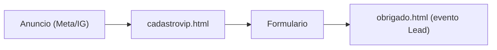

# Briefing de Criativos + Copy — Campanha de Captação

Documento pronto para o designer. Objetivo: captar os **50 casais fundadores** do Nosso Momento, levando tráfego pago (Meta/Instagram) para a landing page `cadastrovip.html`, com conversão medida na `obrigado.html` (evento de Pixel `Lead` / GA4 `generate_lead`).

Foco desta rodada: **casais** (a verba paga fica 100% em casais). O público de borda (ficantes) é trabalhado só no **orgânico** — ver seção "Conteúdo orgânico".

---

## 1. Visão geral da campanha

- **Produto:** Nosso Momento — app que gamifica a relação (economia de "foguinhos" para resgatar momentos a dois).
- **Promessa central (hero da LP):** "Saiam do modo automático. Vivam mais momentos juntos."
- **Sub:** "O app que tira vocês do celular e coloca vocês de volta na relação."
- **Plataforma:** Meta Ads (Instagram + Facebook), foco em Stories/Reels e Feed.
- **Objetivo de campanha:** Conversão (Lead) — otimizar para o evento `Lead` disparado na `obrigado.html`.
- **Escassez/oferta:** 50 primeiros casais fundadores · acesso antecipado **100% gratuito**.
- **Público principal:** casais (18–45), relacionamento estabelecido / morando juntos / rotina desgastada. Viés de entrega feminino (a mulher costuma ser a "organizadora afetiva" e quem compartilha).
- **Fluxo de conversão:**

---

## 2. Diretrizes visuais globais

- **Fundo:** dark (#0a0a0a / #050505). Nada de fundo claro.
- **Glow da marca:** vermelho/rosa -> laranja (rgba(239,68,68,...) e rgba(249,115,22,...)). Usar como brilho/aura, não como bloco chapado.
- **Cor de destaque (texto/CTA):** gradiente `rose-500 -> orange-500`.
- **Logo:** usar `logo-topdown-white-txt.png` (versão branca) sobre fundo escuro.
- **Ícone/símbolo recorrente:** foguinho 🔥 (é a moeda do app).
- **Tom:** intimista, quente, moderno/neon. Falar COM o casal ("vocês"), nunca clínico.
- **Tipografia:** Inter (bold para headline, regular para apoio). Headline curta e legível no mobile.
- **Formatos a entregar:**
  - 9:16 (1080x1920) — Stories/Reels
  - 4:5 (1080x1350) — Feed
  - 1:1 (1080x1080) — cards do carrossel
- **Safe zones (Stories):** manter textos e CTA fora dos ~250px do topo e ~250px da base (evitar sobreposição com UI do Instagram).
- **Prints reais disponíveis** (usar como mockup dentro de moldura de celular):
  - `assets/prints/tela-catalogo.jpeg` — catálogo de desejos
  - `assets/prints/tela-parceiro.jpeg` — loja/economia de foguinhos do parceiro
  - `assets/prints/tela-carrinho.jpeg` — carrinho de resgate
- **Selo de escassez:** badge "Acesso antecipado liberado" / "Restam poucas vagas" no estilo do badge da LP (pill com borda vermelha, `border-red-500/30 bg-red-500/10`).

---

## 3. Guia de copy

- **CTA padrão (botão/último card):** "Quero nossa vaga" (alternativas: "Garantir nossa vaga de fundadores", "Entrar na lista dos 50").
- **Sempre presentes:** menção à gratuidade ("acesso antecipado gratuito") + escassez ("50 casais fundadores").
- **Falar com o casal:** usar "vocês", "a dois", "a relação de vocês".
- **Evitar:** jargão de dating/paquera ("match", "crush", "date"), tom de autoajuda genérico, promessas exageradas.
- **Provas/ângulos disponíveis:**
  - Dor: rotina, "modo automático", casal junto mas cada um no celular.
  - Mecânica: foguinhos -> catálogo -> resgate -> ação real -> lembrança (é lúdico/gamificado).
  - Aspiração: menos tela, mais momentos reais; memória guardada.
- **Regra de legibilidade:** headline on-image com no máximo ~6–8 palavras; texto de apoio menor, alto contraste (branco/quase-branco sobre dark).

---

## 4. Os 5 criativos pagos (foco em CASAIS)

Cada bloco traz: público, objetivo, conceito visual, texto no criativo, copy do anúncio (texto primário / título / descrição), CTA, formato e observação de produção. Onde há 2 headlines, é para **teste A/B** (rodar as duas variações do mesmo criativo).

### C1 — Feminino · "Modo automático" (dor da rotina)

- **Público:** mulheres em relacionamento estabelecido / morando junto.
- **Objetivo:** parar o scroll pela identificação com a dor.
- **Conceito visual:** casal no sofá à noite, lado a lado, cada um no próprio celular, distantes. Tratamento dark + leve glow vermelho ao redor. Clima "frio" que contrasta com o calor da marca.
- **Texto no criativo (headline on-image):**
  - A) "Vocês moram juntos, mas andam distantes?"
  - B) "Saiam do modo automático."
- **Apoio on-image:** "O app que tira vocês do celular e coloca vocês de volta na relação."
- **Copy do anúncio:**
  - Texto primário: "A rotina foi apagando a chama? O Nosso Momento transforma cuidar da relação em um jogo a dois: vocês juntam foguinhos e resgatam momentos de verdade. Acesso antecipado gratuito para os 50 primeiros casais fundadores."
  - Título: "Voltem a viver momentos juntos"
  - Descrição: "Acesso antecipado gratuito · 50 casais fundadores"
- **CTA:** "Quero nossa vaga"
- **Formato:** 9:16 + 4:5.
- **Produção:** foto autoral ou banco; garantir que dá para ler a headline no mobile; logo branca no rodapé + badge de escassez.

### C2 — Feminino · "Economia do amor" (mecânica dos foguinhos)

- **Público:** mulheres curiosas sobre "como funciona" / que gostam de gamificação.
- **Objetivo:** explicar a mecânica de forma atrativa (prova de produto).
- **Conceito visual:** mockup real do app dentro de moldura de celular (`tela-parceiro.jpeg` e/ou `tela-catalogo.jpeg`), com foguinhos 🔥 em destaque flutuando ao redor + glow rosa/laranja.
- **Texto no criativo (headline on-image):**
  - A) "Cuidar da relação virou jogo — e vocês ganham por isso."
  - B) "Juntem foguinhos. Resgatem momentos."
- **Apoio on-image:** "Catálogo privado do casal · surpresas · resgates."
- **Copy do anúncio:**
  - Texto primário: "Cada gesto de carinho vira foguinho. Cada foguinho vira um momento resgatado a dois — um jantar, uma surpresa, um encontro. Simples, divertido e só de vocês. Entrem grátis na lista dos 50 casais fundadores."
  - Título: "A economia do amor de vocês"
  - Descrição: "Acesso antecipado gratuito · vagas limitadas"
- **CTA:** "Quero nossa vaga"
- **Formato:** 4:5 + 9:16.
- **Produção:** usar print real; não cortar o topo da tela (enquadrar a tela inteira dentro da moldura).

### C3 — Feminino · "Menos tela, mais momentos" (aspiracional/memória)

- **Público:** mulheres no ângulo emocional/aspiracional.
- **Objetivo:** desejo — mostrar o resultado (momento real vivido + memória guardada).
- **Conceito visual:** casal vivendo um momento real e afetuoso (passeio, cozinhando juntos, rindo) — luz quente, aconchegante. Selo/etiqueta "memória guardada 🔥" no canto, remetendo à etapa "A Lembrança".
- **Texto no criativo (headline on-image):**
  - A) "Menos textão, mais momentos de verdade."
  - B) "Guardem as memórias que valem a pena."
- **Copy do anúncio:**
  - Texto primário: "No fim, o que fica são os momentos que vocês viveram juntos — não as horas de tela. O Nosso Momento ajuda vocês a criarem (e guardarem) essas lembranças. Acesso antecipado gratuito para os 50 primeiros casais."
  - Título: "Criem memórias, não só stories"
  - Descrição: "Entrem grátis na lista de fundadores"
- **CTA:** "Quero nossa vaga"
- **Formato:** 9:16 + 4:5.
- **Produção:** foto emocional e real (evitar banco genérico "corporativo"); glow suave.

### C4 — Carrossel · "Como funciona" (casais, educativo)

- **Público:** casais (broad, leve viés feminino) — pessoas que precisam entender o produto antes de converter.
- **Objetivo:** educar sobre a jornada e conduzir ao cadastro (ótimo para retargeting e público frio curioso).
- **Formato:** carrossel 1:1 (1080x1080) ou 4:5, **5 cards**. Manter identidade consistente entre os cards (mesma moldura, mesmo glow, numeração 1→5).
- **Conceito por card** (baseado na jornada real da LP):
  - **Card 1 — Gancho:** fundo dark + foguinho grande. Texto: "Transformem a relação em um jogo a dois 🔥" / subtexto "Arrasta para ver como funciona →".
  - **Card 2 — Pareamento:** mockup do app. Texto: "1. Vocês se conectam no app e abrem o catálogo do casal."
  - **Card 3 — Catálogo + Foguinhos:** `tela-catalogo.jpeg`. Texto: "2. Cada um adiciona seus desejos e define o valor em foguinhos."
  - **Card 4 — Resgate + Ação Real:** `tela-carrinho.jpeg`. Texto: "3. Juntem foguinhos, resgatem o momento e vivam ele no mundo real."
  - **Card 5 — CTA/Escassez:** logo branca + badge. Texto: "Entrem grátis na lista dos 50 casais fundadores." Botão visual: "Quero nossa vaga".
- **Copy do anúncio (única, acompanha o carrossel):**
  - Texto primário: "Como o Nosso Momento reacende a relação em 3 passos: 1) vocês montam o catálogo do casal; 2) juntam foguinhos com pequenos gestos; 3) resgatam e vivem momentos de verdade, longe da tela. Acesso antecipado gratuito para os 50 primeiros casais fundadores."
  - Título: "Veja como funciona"
  - Descrição: "Acesso antecipado gratuito · vagas limitadas"
- **CTA:** "Quero nossa vaga"
- **Produção:** usar os prints reais; manter a numeração visível; o último card sempre com CTA + escassez.

### C5 — Masculino · "Plano pronto, sem esforço" (praticidade)

- **Público:** homens em relacionamento que querem surpreender mas "não sabem o quê / não têm tempo".
- **Objetivo:** remover o atrito ("dá trabalho pensar") — posicionar o app como o atalho para ser o parceiro atencioso.
- **Conceito visual:** tom direto, mockup do catálogo (`tela-catalogo.jpeg`) como "menu de ideias prontas". Pode ter um antes/depois leve (dúvida -> parceiro elogiado). Glow laranja/vermelho.
- **Texto no criativo (headline on-image):**
  - A) "Surpreenda ela sem quebrar a cabeça."
  - B) "Ideias de encontro prontas. É só resgatar."
- **Copy do anúncio:**
  - Texto primário: "Sem saber o que fazer no fim de semana? O Nosso Momento entrega um catálogo de ideias e momentos prontos — você resgata e vira o cara atencioso sem esforço. Acesso antecipado gratuito para os 50 primeiros casais fundadores."
  - Título: "Seja o parceiro que surpreende"
  - Descrição: "Acesso antecipado gratuito · vagas limitadas"
- **CTA:** "Quero nossa vaga"
- **Formato:** 9:16 + 4:5.
- **Produção:** tom masculino sem ser clichê; foco na praticidade/atalho.

---

## 5. Conteúdo orgânico — público de borda (ficantes)

Sem verba de mídia (para não desviar o budget do core, que são os casais). Ideias de topo de funil para Reels/posts orgânicos, atraindo quem ainda não é casal formado e pode virar usuário:

- **Reel "Da ficada ao próximo nível":** humor/trend mostrando a evolução de "só um date" para "casal que planeja momentos juntos". CTA leve na legenda ("marca aquele alguém 👀").
- **Reel de trend/humor de rotina de casal:** dueto/POV do tipo "casal no modo automático vs. casal Nosso Momento". Alta chance de compartilhamento.
- **Post carrossel "sinais de que vocês estão no modo automático":** lista relacionável, último card apresenta o app de forma suave.
- **Diretriz:** tom mais jovem e descontraído, sem prometer nada de dating; objetivo é alcance/compartilhamento e construção de audiência, não conversão direta.

---

## 6. Boas práticas Meta

- **Texto primário:** as 2 primeiras linhas são as que aparecem antes do "ver mais" — colocar o gancho + a oferta ali.
- **Pouco texto sobre a imagem:** headline curta e alto contraste; o corpo vai no texto do anúncio.
- **Mobile-first:** testar legibilidade em tela de celular pequena antes de aprovar.
- **Teste A/B:** rodar as variações A/B de headline de cada criativo; deixar o melhor escalar.
- **Consistência de marca:** todo criativo com logo branca + badge de escassez + CTA padronizado.
- **Página de destino:** todos apontam para `cadastrovip.html` (âncora `#form` quando possível), conversão medida em `obrigado.html`.

---

## 7. Checklist de entrega por criativo

- [ ] Versão 9:16 (1080x1920) — quando aplicável
- [ ] Versão 4:5 (1080x1350)
- [ ] Versão 1:1 (1080x1080) — carrossel (C4)
- [ ] Headline on-image legível no mobile (variações A/B quando houver)
- [ ] Logo branca aplicada (`logo-topdown-white-txt.png`)
- [ ] Badge de escassez ("acesso antecipado" / "vagas limitadas")
- [ ] CTA padronizado ("Quero nossa vaga")
- [ ] Prints reais sem corte de topo (C2, C4, C5)
- [ ] Glow/paleta da marca aplicados (vermelho/rosa -> laranja)
- [ ] Texto do anúncio (primário / título / descrição) revisado
- [ ] Safe zones respeitadas (Stories)

---

## Fora de escopo

- Não gera as imagens finais (é briefing para o designer).
- Não configura a campanha no Gerenciador de Anúncios (entrega apenas copy + specs).
