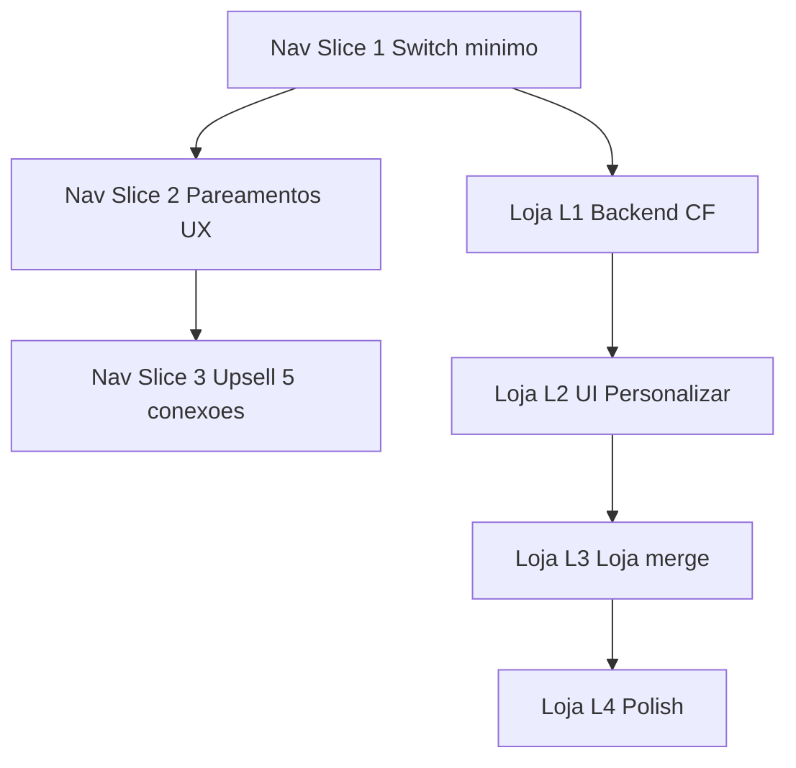

# Prompt de Implementação — VIP, Nav, Loja Custom

> **Como usar:** cole este arquivo (ou referencie-o com `@PROMPT_IMPLEMENTACAO_VIP_MONETIZACAO.md`) no início de uma sessão de agente. Execute **uma fase por vez**, na ordem abaixo. **Não avance** para a próxima fase até passar todos os testes da fase atual.
>
> **Plano estratégico de referência:** `.cursor/plans/ideias_monetização_vip_23a38191.plan.md`
>
> **Leitura obrigatória antes de codar:** [`BRIEFING.md`](../BRIEFING.md)

---

## Papel do agente

Você é o engenheiro responsável por implementar o roadmap de monetização VIP do **Nosso Momento** (Next.js 16 + Firebase + Cloud Functions). Siga o plano à risca, fatie em PRs pequenos, e **teste ao final de cada slice** antes de seguir.

---

## Regras inegociáveis (não violar)

1. **Admin SDK para ações de negócio:** UI → `sendInput()` → `createInput` → `processInput`. O cliente **não** escreve em `usuarios/{uid}` nem `pareamentos/{id}` para lógica de negócio.
2. **Momentos custom NUNCA** em `momentosMestres` nem em `usuarios/{uid}` como lista global. Só em `pareamentos/{pareamentoId}.momentosCustom[criadorUid][]`.
3. **VIP é individual:** flag `usuario.vip` no UID do pagante; **não** propagar VIP para `pareadoUid`.
4. **Free = 1 conexão; VIP = até 5** (`MAX_CONEXOES_VIP = 5`).
5. **Billing nesta fase:** flag manual `vip` + [`VipPopup.tsx`](../../components/VipPopup.tsx) (`faleconosco@nossomomento.app`). **Sem Stripe/IAP** agora.
6. **Um deploy por slice** — não misturar Nav + Loja custom + catálogo `vipOnly` no mesmo PR.
7. **Escopo mínimo:** não refatorar código fora do necessário para o slice atual.
8. **Commits:** só quando o usuário pedir explicitamente.

---

## Pré-voo (rodar uma vez no início do projeto)

```bash
# Raiz do monorepo
cd nosso-momento-next && npm run lint
cd ../functions && npm run lint && npm test
cd ../nosso-momento-next && npm run test:e2e
```

| Check | Esperado |
|---|---|
| `eslint` Next | 0 erros novos |
| `jest` functions | testes existentes passando |
| E2E jornada | 5/5 passando (baseline) |

**Arquivos-chave a ler antes de qualquer slice:**

| Área | Arquivos |
|---|---|
| Store / auth | `lib/store/appStore.ts`, `lib/hooks/useAuth.ts`, `lib/hooks/useParceiroData.ts` |
| CF entrada | `lib/firebase/functions.ts` (`sendInput`) |
| CF processamento | `functions/handlers/processInput.js` |
| Nav | `app/(app)/layout.tsx`, `app/(app)/parear/page.tsx`, `app/(app)/parceiro/page.tsx` |
| Loja | `app/(app)/loja/page.tsx`, `app/(app)/personalizar/page.tsx` |
| Rules | `firestore.rules` |
| Tipos | `lib/types/index.ts` |
| E2E | `e2e/jornada-novo-usuario.spec.ts`, `e2e/helpers/auth.ts` |

---

## Ordem de execução



**Paralelismo permitido:** após Nav Slice 1 estável, L1 pode começar em paralelo com Nav Slice 2 — mas **nunca** deployar L1 e Nav Slice 3 no mesmo PR.

---

# FASE 0 — Nav Slice 1: Switch mínimo

**Objetivo:** coração → `/parceiro` sempre; parceiro ativo persistido; Pareamentos não redireciona automaticamente.

## Tarefas

- [ ] **N1** — `app/(app)/layout.tsx`: `centerHref = '/parceiro'` fixo (free e VIP).
- [ ] **N2** — Criar `lib/utils/setParceiroAtivo.ts` (ou hook equivalente) centralizando:
  - atualizar `conexaoAtiva`, `pareadoUid`, `idPareamentoAmigavel` no Zustand;
  - persistir `localStorage` chave `conexaoAtivaUid:{meuUid}`;
  - garantir compatibilidade com `useParceiroData` (escuta `usuario.pareadoUid`).
- [ ] **N3** — Restaurar parceiro ativo no boot (`useAuth` ou provider): ler `localStorage` → chamar `setParceiroAtivo`; fallback = primeiro de `parceirosAtivos`.
- [ ] **N4** — `parear/page.tsx`: remover auto-redirect para `/parceiro` ao abrir a tela; reutilizar `setParceiroAtivo` em `handleSelectConexao`.
- [ ] **N5** — `parceiro/page.tsx`: header com nome do ativo + chevron (`aria-label="Escolher conexão"`) → `/parear` (Pareamentos).
- [ ] **N6** — Empty state em `/parceiro` sem conexões: CTA "Ir para Pareamentos".
- [ ] **N7** — Revisar redirects existentes (`memorias`, login pós-desparear) para não quebrar fluxo.

## Testes obrigatórios — Nav Slice 1

### Automatizados

```bash
cd nosso-momento-next && npm run lint
cd ../functions && npm test
npm run test:e2e
```

- [ ] E2E `jornada-novo-usuario.spec.ts` passa (ajustar seletores se rota `/parear` mudou comportamento).
- [ ] Criar `e2e/nav-switch-parceiro.spec.ts` (novo) com cenários:
  - [ ] Após parear, bottom nav ❤️ abre `/parceiro` (não `/parear`).
  - [ ] Reload da página mantém mesmo parceiro ativo (localStorage).
  - [ ] Tap no chevron do header abre Pareamentos.

### Manuais (checklist)

- [ ] Usuário com 1 conexão: `/parceiro` mostra dados corretos.
- [ ] Abrir `/parear` permanece na tela (sem redirect).
- [ ] Trocar conexão na lista atualiza loja/clima/desafios do parceiro ativo.
- [ ] Sem conexão: empty state + CTA funciona.

## Definition of Done — Nav Slice 1

- PR isolado; lint + jest + E2E verde.
- Nenhuma mudança em `processInput.js`.
- `setParceiroAtivo` é o único ponto de switch de parceiro.

---

# FASE 0b — Nav Slice 2: Pareamentos UX

**Objetivo:** polish da tela de gestão de conexões.

## Tarefas

- [ ] **N8** — Título/copy "Pareamentos" (não esconder form de parear atrás de redirect).
- [ ] **N9** — Lista + parear + link convite sempre visíveis na mesma tela.
- [ ] **N10** — Tap no card ativo: opcional navegar para `/parceiro` após switch.
- [ ] **N11** — Links de entrada consistentes (Dashboard, Perfil) apontando para Pareamentos.
- [ ] **N12** — Badge "Ativo" no card selecionado (refinar se necessário).

## Testes obrigatórios — Nav Slice 2

```bash
cd nosso-momento-next && npm run lint && npm run test:e2e
```

- [ ] E2E: fluxo parear → lista visível → gerar convite sem redirect indesejado.
- [ ] Manual: usuário VIP com 2+ conexões troca entre cards e vê badge Ativo.

## Definition of Done — Nav Slice 2

- UX de Pareamentos utilizável como "switch hub" sem confusão de navegação.

---

# FASE 0c — Nav Slice 3: Upsell e limite 5 conexões

**Objetivo:** monetização de poliamor + teto VIP.

## Tarefas

- [ ] **N13** — Constante `MAX_CONEXOES_VIP = 5` em frontend (`lib/constants.ts` ou similar) e `processInput.js`.
- [ ] **N14** — UI Pareamentos: slots 2–5 locked para free; contador `X/5` para VIP.
- [ ] **N15** — Free + já pareado + "Nova Conexão" → `VipPopup`.
- [ ] **N16** — VIP com 5 conexões + "Nova Conexão" → mensagem "Limite de 5 conexões atingido" (sem paywall).
- [ ] **N17** — Backend `processInput.js` pairing: erro `max_connections_reached` se VIP já tem 5 vínculos ativos.
- [ ] **N18** — Manter regra simétrica: receptor free já pareado → falha mesmo se remetente VIP.

## Testes obrigatórios — Nav Slice 3

### Jest (novos em `processInput.test.js`)

- [ ] VIP com 5 pareamentos ativos → pairing rejeitado com `max_connections_reached`.
- [ ] VIP com 4 → 5º pareamento permitido.
- [ ] Free com pareamento existente → `sender_already_paired` / `receiver_already_paired`.

```bash
cd functions && npm test
```

### E2E (novo `e2e/nav-vip-conexoes.spec.ts` ou extensão)

- [ ] Free com 1 conexão: tap "Nova Conexão" mostra VipPopup (mock `vip: false` no emulador ou conta de teste).
- [ ] Conta VIP de teste (flag manual): contador exibe formato `N/5`.

### Manual

- [ ] VIP no 6º pareamento bloqueado na UI e no CF.

## Definition of Done — Nav Slice 3

- Limite 5 enforced em UI **e** CF; testes Jest cobrindo os 3 cenários acima.

---

# FASE 1 — Loja L1: Backend (Cloud Functions)

**Objetivo:** modelo `momentosCustom` + handlers Admin; migrar save de catálogo mestre para CF.

## Tarefas

- [ ] **L1.1** — Tipos: `MomentoCustom`, `CatalogoCfg` (`preco?`, `bloqueado?`, `excluido?`) em `lib/types/index.ts`.
- [ ] **L1.2** — Handler `catalog_personalizado_save` em `processInput.js`:
  - payload: `fromUid`, `catalogoPersonalizado`, `partnerUids` (para notificação);
  - rejeitar `excluido: true` se `!sender.vip`;
  - Admin `update` em `usuarios/{fromUid}.catalogoPersonalizado`;
  - opcional: criar notificação `catalog_update` para parceiros (pode ficar para L4).
- [ ] **L1.3** — Handler `custom_moment_create`:
  - validar `sender.vip`, membro do `pareamentoId`, limite futuro de itens;
  - gravar em `pareamentos/{id}.momentosCustom[fromUid]` com `id` uuid, `ativo: true`.
- [ ] **L1.4** — Handler `custom_moment_delete`:
  - validar VIP + criador + membro do pareamento;
  - remover item do array (ou `ativo: false`).
- [ ] **L1.5** — Estender `moment_redeem`:
  - aceitar ids `custom_{pareamentoId}_{itemId}`;
  - validar item existe no `pareamentos/{pareamentoId}.momentosCustom[parceiroUid]`;
  - debitar foguinhos do resgatante; fluxo igual ao mestre.
- [ ] **L1.6** — Garantir que nenhum handler escreve em `momentosMestres` a partir de custom.
- [ ] **L1.7** — Hook/listener: ler `pareamentos/{pareamentoAtivo}` para `momentosCustom` (preparar L2/L3).

## Testes obrigatórios — Loja L1

### Jest (`functions/handlers/processInput.test.js`)

Adicionar `describe` para cada handler:

| Cenário | Esperado |
|---|---|
| `catalog_personalizado_save` free com `excluido` | erro `vip_required` |
| `catalog_personalizado_save` VIP com preço/bloqueio | update em usuario |
| `custom_moment_create` sem vip | erro `vip_required` |
| `custom_moment_create` VIP membro do pareamento | item no doc pareamento |
| `custom_moment_create` UID fora do pareamento | erro `not_pair_member` |
| `custom_moment_delete` outro UID | erro `forbidden` |
| `moment_redeem` custom válido | tarefa criada + foguinhos debitados |
| `moment_redeem` custom de outro pareamento | erro |

```bash
cd functions && npm run lint && npm test
```

### Manual (emulador ou staging)

- [ ] `sendInput('catalog_personalizado_save')` persiste no Firestore via Admin.
- [ ] Cliente **não** consegue `updateDoc` em `pareamentos` (rules bloqueiam).

## Definition of Done — Loja L1

- Todos os handlers novos com testes Jest.
- `moment_redeem` cobre custom.
- Zero writes de custom em `momentosMestres`.

---

# FASE 2 — Loja L2: UI `/personalizar`

**Objetivo:** tela completa com gates VIP; **remover `updateDoc` direto**.

## Tarefas

- [ ] **L2.1** — Remover `updateDoc` de `personalizar/page.tsx`; salvar via `sendInput('catalog_personalizado_save')`.
- [ ] **L2.2** — Seção **Catálogo mestre**: preço + bloquear (free+VIP); excluir só VIP (`excluido`); free vê lixeira desabilitada → VipPopup.
- [ ] **L2.3** — Seção **Excluídos** colapsável (VIP) com Restaurar (`excluido: false`).
- [ ] **L2.4** — Seção **Meus momentos (custom)** lendo `pareamentos/{ativo}.momentosCustom[meuUid]`.
- [ ] **L2.5** — Botão "Criar momento" → modal Nome / Valor (1–999) / Imagem placeholder (emoji ou URL fixa até L4).
- [ ] **L2.6** — Criar/excluir custom via `sendInput('custom_moment_create'|'custom_moment_delete')`.
- [ ] **L2.7** — Contexto = pareamento ativo (`conexaoAtiva` / `idPareamentoAmigavel`); trocar parceiro muda lista.
- [ ] **L2.8** — Loading/erro/toast ao processar input (padrão existente do app).

## Testes obrigatórios — Loja L2

```bash
cd nosso-momento-next && npm run lint
cd ../functions && npm test
```

### E2E novo: `e2e/loja-personalizar.spec.ts`

Pré-requisito: conta de teste VIP (flag manual no Firestore) + usuário pareado.

- [ ] Free: botão excluir mestre abre VipPopup.
- [ ] Free: "Criar momento" abre VipPopup.
- [ ] VIP: criar custom com nome+preço → item aparece na lista após processamento.
- [ ] VIP: bloquear mestre → salvar → item some da preview (estado local ou reload).
- [ ] Trocar parceiro ativo → lista custom diferente (se 2 pareamentos VIP).

### Manual

- [ ] Network tab: nenhum `updateDoc` direto em `usuarios` ao salvar (só `createInput`).

## Definition of Done — Loja L2

- `personalizar/page.tsx` 100% via `sendInput` para writes de negócio.
- Gates free/VIP corretos na UI.

---

# FASE 3 — Loja L3: `/loja` merge + resgate

**Objetivo:** exibir custom do pareamento ativo; resgate funcional.

## Tarefas

- [ ] **L3.1** — `loja/page.tsx`: merge `momentosMestres` filtrados + `momentosCustom[parceiroUid]` do pareamento ativo.
- [ ] **L3.2** — Filtrar mestres: omitir `bloqueado` ou `excluido` em `parceiro.catalogoPersonalizado`.
- [ ] **L3.3** — Seção visual separada "Personalizado" com badge.
- [ ] **L3.4** — IDs no carrinho: `custom_{pareamentoId}_{itemId}`.
- [ ] **L3.5** — Resgate via `sendInput('moment_redeem')` com id custom.
- [ ] **L3.6** — Parceiro free pode **ver e resgatar** custom do VIP no mesmo pareamento.

## Testes obrigatórios — Loja L3

### E2E: `e2e/loja-custom-resgate.spec.ts`

- [ ] VIP cria custom em Personalizar.
- [ ] Parceiro (free ou VIP) vê item na Loja na seção Personalizado.
- [ ] Resgate com foguinhos suficientes → momento enviado (fluxo existente de tarefa).
- [ ] Mestre bloqueado não aparece na loja.
- [ ] Mestre excluído (VIP) não aparece na loja nem em personalizar (só em Excluídos).

```bash
cd nosso-momento-next && npm run test:e2e
cd ../functions && npm test
```

### Manual

- [ ] Poliamor: custom do pareamento A não aparece com parceiro B ativo.

## Definition of Done — Loja L3

- Isolamento por pareamento verificado em E2E.
- Nenhum write em `momentosMestres` a partir da loja.

---

# FASE 4 — Loja L4: Polish (opcional)

**Objetivo:** upload Storage, notificações, limites.

## Tarefas

- [ ] **L4.1** — Upload imagem custom para Firebase Storage no fluxo de criação.
- [ ] **L4.2** — `catalog_personalizado_save` dispara notificação `catalog_update` internamente no CF.
- [ ] **L4.3** — Limite máx. custom por criador (ex. 20) enforced no CF.
- [ ] **L4.4** — Atualizar [`VipPopup.tsx`](../../components/VipPopup.tsx) com benefícios reais entregues (copy).

## Testes obrigatórios — Loja L4

- [ ] Jest: limite 21º custom rejeitado.
- [ ] Manual: upload imagem aparece na loja.
- [ ] Manual: parceiro recebe notificação após salvar catálogo.

---

# FASES FUTURAS (não implementar neste ciclo)

| Fase | Escopo | Quando |
|---|---|---|
| Billing Stripe/IAP | Webhook → `vip: true` | Após L1–L3 estáveis |
| Catálogo `vipOnly` | Free tier reduzido | Pós loja custom |
| Wrapped | Preview free / completo VIP | Retenção |
| B2B patrocínios | Momentos patrocinados R$300 | Fase 4 plano |

---

## Protocolo de teste ao final de **qualquer** slice

Execute nesta ordem; **pare no primeiro falha**:

```bash
# 1. Lint frontend
cd nosso-momento-next && npm run lint

# 2. Lint + unit tests backend
cd ../functions && npm run lint && npm test

# 3. Build frontend (captura erros TS)
cd ../nosso-momento-next && npm run build

# 4. E2E (dev server rodando ou baseURL configurada)
npm run test:e2e
```

| Etapa | Critério de sucesso |
|---|---|
| Lint | 0 erros introduzidos pelo slice |
| Jest | todos passando + novos testes do slice |
| Build | `next build` sem erro |
| E2E | baseline + specs novos do slice verdes |

**Se E2E falhar:** usar `e2e/helpers/logCollector` e relatório em `e2e/reports/` para diagnosticar.

---

## Checklist de code review (todo PR)

- [ ] Nenhum `updateDoc`/`setDoc` novo em `usuarios` ou `pareamentos` no cliente (exceto `notificacoes.lida`).
- [ ] Custom só em `pareamentos/{id}.momentosCustom`.
- [ ] Gates VIP checados no CF, não só na UI.
- [ ] `MAX_CONEXOES_VIP` consistente frontend/backend.
- [ ] Tipos TypeScript atualizados.
- [ ] Testes Jest para toda lógica nova em `processInput.js`.
- [ ] E2E ou checklist manual documentado no PR.
- [ ] Sem secrets commitados (`.env`, service accounts).

---

## Comandos úteis

```bash
# Dev local
cd nosso-momento-next && npm run dev

# Deploy functions (só quando usuário pedir)
cd functions && npm run deploy

# E2E com browser visível
cd nosso-momento-next && npm run test:e2e:headed

# Rodar um spec só
npx playwright test e2e/nav-switch-parceiro.spec.ts
```

---

## Prompt curto para iniciar cada sessão

Copie e preencha o `[SLICE]`:

```
Implemente o [SLICE] do PROMPT_IMPLEMENTACAO_VIP_MONETIZACAO.md.

Regras:
- Uma fase por vez; não pular testes.
- Admin SDK (sendInput) para writes de negócio.
- Custom só em pareamentos/{id}.momentosCustom.
- PR mínimo; não misturar slices.

Ao terminar:
1. Rode lint + jest + build + e2e do protocolo.
2. Liste o que foi feito, arquivos alterados, e resultado dos testes.
3. Indique checklist manual pendente (se houver).
4. Não commitar até eu pedir.
```

**Exemplos de `[SLICE]`:**
- `FASE 0 — Nav Slice 1`
- `FASE 1 — Loja L1`
- `FASE 2 — Loja L2`

---

## Métricas pós-lançamento (validar em produção)

- % sessões com `conexaoAtiva` restaurada do localStorage.
- Conversão em Pareamentos (Nova Conexão bloqueada → email VIP).
- Momentos custom criados por VIP / taxa de resgate.
- Erros CF: `vip_required`, `max_connections_reached`, `not_pair_member`.

---

*Documento gerado a partir do plano `ideias_monetização_vip_23a38191` — manter sincronizado quando o plano mudar.*
